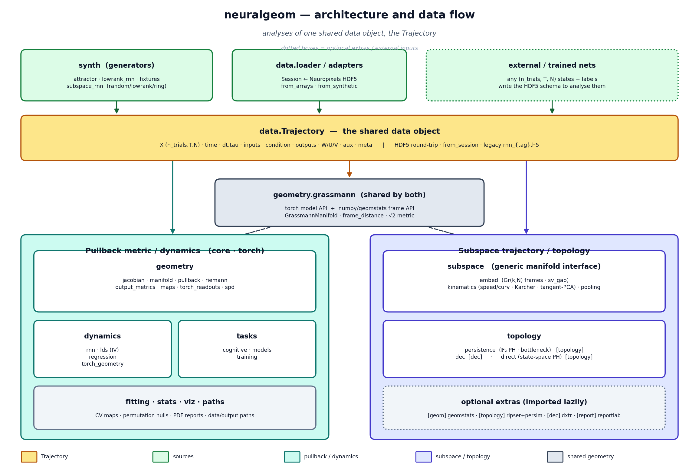

# neuralgeom

**Differential geometry and topology of neural population activity.**

`neuralgeom` is a Python library for describing how neural representations and
dynamics are organised geometrically. It provides three families of tools that
operate on the same object, a batch of high-dimensional state trajectories from
a recording, a simulation, or a trained network:

* **Pullback metrics.** For a differentiable map `f` (a decoder, a readout, or
  the one-step update of a recurrent network), the pullback metric
  `g = Jᵀ M J` measures how `f` distorts its domain: which directions are
  magnified, which are collapsed, and how that varies from point to point.
  From `g` follow local volume, anisotropy, curvature and geodesics.
* **Subspace trajectories.** Instead of the raw state `x(t) ∈ ℝᴺ`, track the
  `k`-dimensional subspace that the activity locally occupies as a point on the
  Grassmannian `Gr(k, N)` (`Gr(1, N) = ℝPᴺ⁻¹`), and describe how that point
  moves with Riemannian kinematics: speed, covariant acceleration, curvature,
  Karcher mean, tangent PCA.
* **Topology.** Persistent homology of the subspace trajectory, within a trial
  and pooled across trials, with bottleneck distances between conditions and an
  optional discrete-exterior-calculus layer.

Alongside these are distances between metric tensors (SPD manifold) and between
subspaces (Grassmannian), Fisher–Rao output metrics, estimators of linear
dynamics from data, and utilities for synthetic data, cognitive tasks and RNN
training.

> **Status.** This is an exploratory research package under active development.
> The library is tested, but the analyses it supports are methods under
> evaluation rather than established results, and the API may change between
> versions. The recordings and datasets the methods were developed against are
> not bundled.



## Motivation

Population activity is usually summarised by a linear projection and a
Euclidean distance. Both choices are arbitrary, and many geometric statements
about neural data depend on them. Two constructions make the geometry
intrinsic:

1. **A metric induced by the computation.** Pulling a codomain metric back
   through a fitted map defines distances in state space by what the map
   resolves, not by firing-rate scale. Since `rank(g) = dim(domain)`, placing a
   low-dimensional manifold in the domain and the high-dimensional
   representation in the codomain yields a full geometry (volume, anisotropy,
   curvature), whereas a scalar decoder yields only a rank-1 metric.
2. **A trajectory of subspaces.** Recurrence and periodicity of a computation
   that are hard to see in the state trajectory can become explicit when the
   *coding subspace* is tracked instead: a rotating coding direction traces a
   closed curve on `ℝPᴺ⁻¹`, which persistent homology detects as an `H1`
   feature without any embedding.

The library implements both constructions on one data object so that they can
be applied, and compared, on the same activity.

## Installation

Requires Python ≥ 3.10.

```bash
pip install -e .                       # core: numpy<2, scipy, scikit-learn, torch, h5py, matplotlib
pip install -e '.[geom,topology]'      # + Grassmannian geometry and persistent homology
pip install -e '.[full]'               # + discrete exterior calculus and PDF reports
```

Or with conda:

```bash
conda env create -f environment.yml
conda activate neuralgeom
pip install -e .
```

The core is deliberately small. `torch` is a core dependency because the
pullback-metric and dynamics tools are built on its autograd. Everything else
is an optional extra, imported lazily with an explicit install hint, so
`import neuralgeom` works with only the core installed.

| extra | packages | enables |
|---|---|---|
| `geom` | geomstats | closed-form Grassmannian geometry; all of `neuralgeom.subspace` |
| `topology` | ripser, persim | persistent homology and bottleneck distances (`neuralgeom.topology`) |
| `dec` | dxtr | discrete exterior calculus (`neuralgeom.topology.dec`) |
| `report` | reportlab, pillow, pypdf | PDF reports (`neuralgeom.viz`) |
| `notebook` | ipykernel, jupyterlab | running the example notebooks |

`numpy` is pinned below 2.0 because the current `geomstats` release requires
it. Check an environment with `python examples/check_env.py`, and exercise
every installed component with `python examples/verify_all.py`.

## Capabilities

```
neuralgeom/
  geometry/   pullback metrics of differentiable maps: per-sample Jacobians,
              g = Jᵀ M J, volume element, anisotropy, Gaussian curvature,
              Christoffel symbols and geodesics of a metric field; codomain
              metrics including Fisher–Rao families; readout maps with exact
              Jacobians; distances and means on the SPD manifold (affine-
              invariant, log-Euclidean, Bures–Wasserstein, fixed-rank PSD) and
              on the Grassmannian (principal angles, geodesic distance,
              Fréchet mean)
  subspace/   sliding-window Grassmannian embedding with a singular-value-gap
              diagnostic; Riemannian speed, covariant acceleration, curvature,
              path length; Karcher mean; tangent PCA (intrinsic
              dimensionality); pooling of frames across trials
  topology/   persistent homology (𝔽₂) on precomputed distance matrices,
              within-trial and across-trial; bottleneck distance matrices;
              optional discrete exterior calculus; comparison with persistent
              homology of the raw state distances
  dynamics/   recurrent and input Jacobians along trajectories, eigenvalue
              spectra and time constants, fixed and slow points, readout and
              input subspaces; estimation of linear dynamics from data
              (global, sliding-window, cubic-field) with an instrumental-
              variable correction for finite-difference velocity bias,
              shared-field / per-condition input inference, and the
              Helmholtz (gradient / rotational) decomposition
  data/       the Trajectory object and its HDF5 schema; loaders for
              recordings; adapters from arrays and synthetic data; a shared
              PCA state space; pluggable dimensionality reduction; condition
              builders
  synth/      synthetic data with known generating dynamics: a two-attractor
              model, low-rank rate RNNs, and connectivity-family rate RNNs
              (random, low-rank, ring)
  tasks/      cognitive tasks (perceptual decision, evidence integration,
              context-dependent decision, delayed match-to-sample), RNN models
              with a pure one-step update, and a supervised trainer
  viz/        plotting style, metric-field renderings, PDF reports
  fitting.py  differentiable readout maps and trial-grouped cross-validation
  stats.py    permutation tests (Mantel, partial Mantel) and shuffle controls
  paths.py    data and output locations

scripts/      runnable analyses and demonstrations
tests/        numerical tests
docs/         formulation.tex, subspace_methods.tex (mathematical definitions)
```

## What can be analysed

The library accepts any batch of state trajectories `X (n_trials, T, N)` with
a time axis, wrapped in a `neuralgeom.data.Trajectory`. Adapters exist for
plain arrays, the bundled synthetic generators, recording sessions, and any
external source that writes the HDF5 schema (for example, a trained network).

Questions the tools address include:

* How does a fitted map (a behavioural decoder, a readout, the recurrent
  update) distort neural state space? Where is it most sensitive, along which
  directions, and how does this vary with condition or time?
* How similar are the local geometries of two populations, layers, or
  conditions? (Distances between metric tensors and between subspaces.)
* Does the coding subspace move over a trial, and how: in a directed way, or
  along a closed orbit? Is the motion low-dimensional?
* Does the activity contain loops or other recurrent structure, within a
  trial or across trials, and is that structure present in both the state
  trajectory and the subspace trajectory?
* What are the recurrent dynamics of a trained network: time constants,
  slow points, line attractors, and the alignment of readout, input and
  high-variance subspaces?
* Can linear dynamics be estimated from recorded population activity, and how
  much of the velocity field is gradient-like versus rotational?

## Quick start

```python
from neuralgeom.synth.subspace_rnn import SubspaceRNNConfig, make_trajectory

cfg  = SubspaceRNNConfig(connectivity="ring", ring_rotating=True, N=50, n_trials=8)
traj = make_trajectory(cfg)          # a neuralgeom.data.Trajectory
traj.save("ring_rotating.h5")          # HDF5 round-trip
```

Subspace trajectory and topology (needs the `geom` and `topology` extras):

```python
from neuralgeom.subspace import EmbedConfig, embed_from_trajectory, compute_kinematics, tangent_pca
from neuralgeom.topology.persistence import within_trial_distances, persistent_homology, max_persistence

emb = embed_from_trajectory(traj, trial=0, cfg=EmbedConfig(k=1, win=50, stride=10))
kin = compute_kinematics(emb["frames"], emb["win_times"])   # speed, curvature, path length, ...
tp  = tangent_pca(emb["frames"])                            # intrinsic dimensionality

D   = within_trial_distances(traj, 0, EmbedConfig(k=1))     # Grassmannian geodesic distances
h1  = max_persistence(persistent_homology(D, maxdim=1)[1])  # persistence of the loop on ℝPᴺ⁻¹
```

Pullback metric of a feed-forward map and of a trained recurrent network:

```python
import torch, torch.nn as nn
from neuralgeom.geometry import ModelPullbackGeometry

model = nn.Sequential(nn.Linear(3, 64), nn.Tanh(), nn.Linear(64, 10))
geo = ModelPullbackGeometry(model)
vol = geo.volume_element(torch.randn(32, 3))   # local volume magnification √det g

from neuralgeom.tasks import make_task, make_model, train
task = make_task("context_decision", dt=25, seed=0)
rnn  = make_model("vanilla", task.spec, hidden_size=96, dt=task.dt)
train(rnn, task, steps=3000)
# then neuralgeom.dynamics: recurrent_jacobian, jacobian_spectrum, find_slow_points, ...
```

## Examples

Two narrated notebooks each work a single network end to end and explain what
every quantity describes. Their outputs are stripped in version control, so
run them to regenerate the figures (`pip install -e '.[notebook]'`).

* [`examples/example_ring_attractor.ipynb`](examples/example_ring_attractor.ipynb):
  a ring-attractor RNN with a rotating bump. Grassmannian embedding and the
  singular-value gap, distance from the initial subspace and recurrence,
  Riemannian kinematics, tangent PCA, persistent homology of the `ℝP¹` loop,
  its dependence on `k`, discrete exterior calculus, and a comparison with the
  homology of the raw state distances.
* [`examples/example_task_trained_rnn.ipynb`](examples/example_task_trained_rnn.ipynb):
  a vanilla RNN trained on evidence integration. Psychometrics, population
  geometry, recurrent-Jacobian spectra and effective time constants, slow
  points and the line attractor, readout versus input subspaces, the
  state-space pullback metric, and the subspace trajectory of the same
  network.

Smaller entry points:

* `examples/quickstart.py`: the shortest end-to-end script.
* `examples/neuralgeom_tour.ipynb`: a brief guided tour.
* `scripts/subspace/demo_subspace_pipeline.py`: generate, embed, kinematics and
  persistent homology across connectivity families and regimes.
* `scripts/demos/`: pullback metric, SPD geometry, Grassmannian geometry, and
  regression demonstrations on small models.
* `scripts/rnn/`: train RNNs on the four cognitive tasks and analyse their
  dynamics.
* `scripts/attractor/`: dynamics estimation and pullback analyses on the
  two-attractor model, with and without recordings.
* `scripts/neural/`: quality control, population structure, reducer sweeps,
  decoder pullback fields with permutation controls, and the condition-manifold
  pullback on recorded populations (requires the recordings).

Analyses that use trained networks from other repositories read them through
the same HDF5 schema:

```python
from neuralgeom.data import load_trajectory
traj = load_trajectory("path/to/states.h5")
```

### Data location

Recordings are not part of the repository. Scripts that need them resolve the
data directory from, in order, the `NEURALGEOM_DATA_DIR` environment variable,
a one-line `data_dir.local` file in the repository root (see
`data_dir.local.example`), or `./SampleData`. Inspect the resolved layout with:

```bash
python -c "from neuralgeom.paths import describe_paths; print(describe_paths())"
```

## Documentation

| file | contents |
|---|---|
| [`docs/formulation.tex`](docs/formulation.tex) | the pullback-metric mathematics |
| [`docs/subspace_methods.tex`](docs/subspace_methods.tex) | definitions of the subspace-trajectory and topology constructions |
| [`examples/README.md`](examples/README.md) | the notebooks and verification scripts |

## Background

Pullback metrics of neural representations: Zavatone-Veth et al. (magnification
near decision boundaries); Cayco-Gajic and Pellegrino (geometry-aware
similarity metrics). Low-rank recurrent networks: Mastrogiuseppe and Ostojic;
Beiran et al. Fixed-point analysis of trained networks: Sussillo and Barak.
Shared dynamical motifs: Driscoll et al. Full reference lists are in the two
`.tex` documents.
